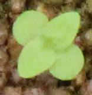
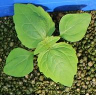

# FieldInfomatics-Lecture-2021
フィールドインフォマティクス2021講義
講義サポート ページ  
場所：オンライン

## 質問は随時受け付けています ZoomのChatか　[ここクリック](https://forms.gle/hXRX8yZgCNfZq3sr8)　　
#### NOTE:回数制限なし、記名なし、長さ制限なし
#### 講義資料前半のPPTは[こちらから](https://drive.google.com/file/d/1uEqWchEzomL5aJkJfulluiyj5jdAykCR/view?usp=sharing)  
[印刷用バージョン](https://drive.google.com/file/d/1ZBpS4JlzQ4BFdvhtFEoEn9Z9h5X0vtGE/view?usp=sharing)
#### 講義資料後半のPPTは[こちらから](https://drive.google.com/file/d/1NKECSIGJ7tAC9WS9QQNps0PYHjC48bRW/view?usp=sharing)  
[印刷用バージョン](https://drive.google.com/file/d/1uk7iYQt0fGpz6vDqikiUh8umn859lT9V/view?usp=sharing)

[おすすめ深層学習入門](https://youtu.be/W92VcivhoBs)
### [Study_CNN_Explainer](https://utokyo-fieldphenomics-lab.github.io/Study_CNN_Explainer/) (本日の講義用に修正した)  

original version from Here: [Zijie J. Wang et al., 2020](https://github.com/poloclub/cnn-explainer)  
we modified the training data and model for students with agriculture background.  
modified version can be [found here](https://github.com/UTokyo-FieldPhenomics-Lab/Study_CNN_Explainer).

## ハンズオン：深層学習による雑草の分類  With アシスタント 石井昌範
Google Colaboratoryを利用する
- 雑草分類に関する深層学習のチュートリアル。
- Google Colaboratoryベースのノートブックです。 必要なのは、インターネット接続、Google Chromeブラウザ、およびGoogleアカウントだけです。 **クリックでGPU学習環境！**
- ノートブックを開くには、各セクションの をクリックします。 コードのカスタマイズと保存には、GoogleアカウントにログインしてローカルのGoogleドキュメントフォルダーにipynbをコピーすることをお勧めします。

### 1~4、順番で練習しましょう！
 Google Colaboratoryは必ずランタイムを初期化してから実行してください。
   

### 01　雑草の生育期間を区別せずに分類器を作る(2020/5/25)

    

雑草の生育期間（芽生え・生育済み）を区別せずに分類器を作成します。
育成した雑草の種類はハキダメギク、ホソアオゲイトウ、イチビ、イヌビエ、コセンダングサ、マメアサガオ、メヒシバ、オヒシバ、オイヌタデ、シロザの10種類です。  

   

### 02　雑草の生育期間を区別して分類器を作る（芽生え）(2020/5/25)

   

雑草の生育期間が芽生えのデータを用いて分類器を作成します。
育成した雑草の種類はハキダメギク、ホソアオゲイトウ、イチビ、イヌビエ、コセンダングサ、マメアサガオ、メヒシバ、オヒシバ、オイヌタデ、シロザの10種類です。  

   

### 03　雑草の生育期間を区別して分類器を作る（生育済み）(2020/5/25)

   

雑草の生育期間が生育済みのデータを用いて分類器を作成します。
育成した雑草の種類はハキダメギク、ホソアオゲイトウ、イチビ、イヌビエ、コセンダングサ、マメアサガオ、メヒシバ、オヒシバ、オイヌタデ、シロザの10種類です。  

   

### 04　科目が同じ品種をグループにして分類器を作る（生育済み）(2020/5/26)

   

雑草の生育期間が生育済みのデータを用いて分類器を作成します。
ハキダメギク、ホソアオゲイトウ、イチビ、イヌビエ、コセンダングサ、マメアサガオ、メヒシバ、オヒシバ、オイヌタデ、シロザの10種類の雑草のうち科目が同じのものを一つのclassにまとめるます。イネ科（イヌビエ、メヒシバ、オヒシバ）、キク科（ハキダメギク、コセンダングサ）とその他5種類に分けて分類器を作成します。  

   

## Maintainers
Wei GUO (Oceam), 石井昌範.
東京大学国際フィールドフェノミクス研究拠点  
International Field Phenomics Research Laboratory, The University of Tokyo, Tokyo, Japan
